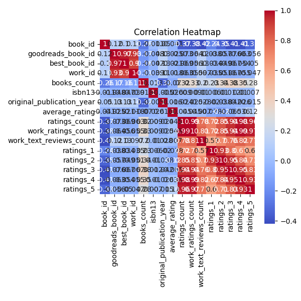
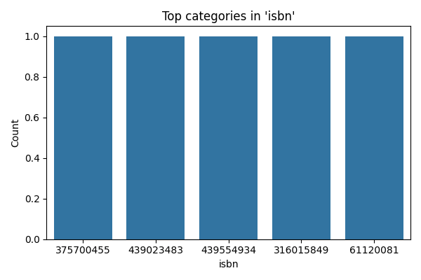
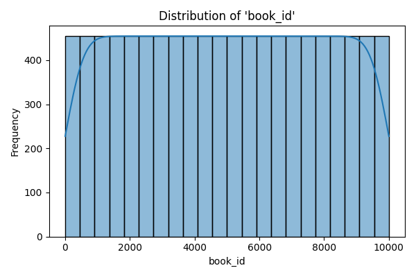

# Analyzing the Goodreads Dataset

## Introduction
In our exploration of the Goodreads dataset, we examined a rich collection of data comprising 10,000 rows and 23 columns. This dataset likely represents a diverse array of books, capturing various attributes such as book IDs, authors, publication years, ratings, and reviews. By analyzing this data, we aim to uncover insights that can enhance our understanding of trends in literature, reader preferences, and the overall performance of books on the Goodreads platform.

## Key Insights
Our analysis revealed several key insights:

1. **Missing Values**: The dataset contains missing values in several columns, notably in the `isbn`, `isbn13`, `original_publication_year`, and `language_code` fields. This suggests potential gaps in the data that may affect our analyses and interpretations.

2. **Summary Statistics**: The numeric columns provided a wealth of information. For instance, the average rating of books is approximately 4.00, indicating a generally positive reception among readers. However, the presence of a wide range of `ratings_count` (from 2,716 to 4,780,653) suggests that some books are significantly more popular than others.

3. **Top Authors and Titles**: The categorical analysis highlighted prominent authors such as Stephen King and Nora Roberts, who have the highest number of books in the dataset. Additionally, certain titles appeared multiple times, indicating potential bestsellers or classics that continue to resonate with readers.

4. **Correlation Analysis**: The correlation matrix indicated strong relationships between various ratings categories, particularly between `ratings_count` and `ratings_4` and `ratings_5`, suggesting that books with higher ratings also tend to receive more reviews.

## Visualizations
To better illustrate our findings, we created several visualizations:

- **Correlation Heatmap**:  provides a visual representation of the relationships between numeric variables. The strong correlations observed between the different ratings categories underscore the interconnectedness of reader feedback.

- **Top Categories**:  showcases the most common authors and titles, revealing the literary preferences within the dataset. This visualization highlights the most influential figures in the world of books.

- **Numeric Distribution**:  illustrates the distributions of key numeric variables, allowing us to identify patterns and outliers in the data effectively.

## Conclusion and Next Steps
The insights derived from this analysis of the Goodreads dataset provide a foundational understanding of reader preferences and book performance. However, the presence of missing values necessitates further cleaning and imputation to enhance the dataset's robustness. 

Moving forward, we could explore deeper analyses, such as sentiment analysis of reviews, trends over time in publication years, and the impact of various attributes on book ratings. Additionally, leveraging machine learning techniques could help us predict book ratings based on historical data, offering valuable recommendations for readers and authors alike. 

In summary, this dataset presents a promising opportunity for further exploration and analysis, with the potential to yield actionable insights for the literary community.