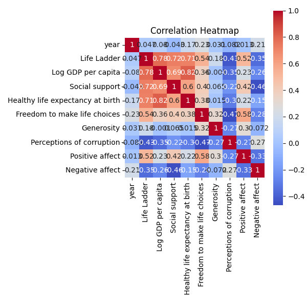
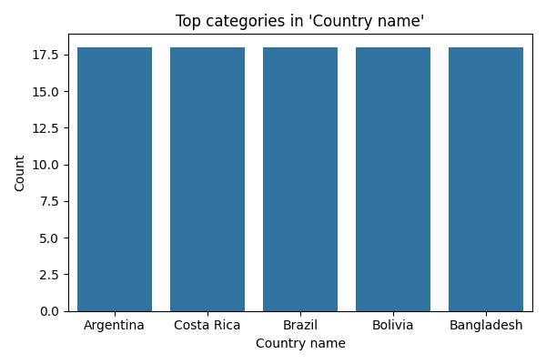
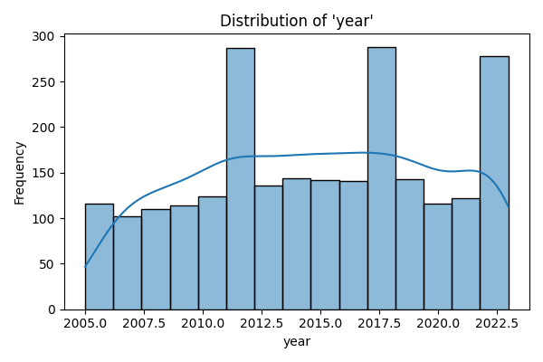

# Exploring Global Happiness: Insights from the Happiness Dataset

In our exploration of the **happiness.csv** dataset, we delved into the factors contributing to happiness across different countries and years. This dataset, comprising 2,363 rows and 11 columns, provides a rich tapestry of information, including metrics such as Life Ladder, Log GDP per capita, Social support, and various emotional indicators. Understanding these elements can offer valuable insights into the well-being of populations around the globe.

## Key Insights from the Analysis

Our initial analyses revealed several important findings:

- **Missing Values**: We identified varying degrees of missing data across different columns, with the most significant gaps in Generosity (81 missing values) and Perceptions of corruption (125 missing values). This indicates areas where data collection may need improvement to provide a more comprehensive view of happiness determinants.
  
- **Summary Statistics**: The numeric columns showed a wide range of values. For instance, the average Life Ladder score was approximately 5.48, with a maximum of 8.02, suggesting that while many countries experience moderate happiness, there are outliers with significantly higher scores. The average Log GDP per capita was around 9.40, reflecting the economic factors that often correlate with happiness.

- **Top Categorical Observations**: The analysis of categorical data revealed that Argentina, Costa Rica, Brazil, Bolivia, and Bangladesh each contributed 18 entries to the dataset, highlighting these countries' representation in the happiness discourse.

- **Correlation Matrix**: The correlation matrix unveiled intriguing relationships among variables. Notably, Life Ladder exhibited a strong positive correlation with Log GDP per capita (0.784) and Social support (0.723), implying that economic prosperity and social connections significantly influence happiness. Conversely, Negative affect was negatively correlated with Life Ladder (-0.352), indicating that higher levels of negative emotions are associated with lower happiness.

## Visualizations

To better illustrate our findings, we created several visualizations:

1. **Correlation Heatmap**:  - This heatmap visually represents the correlation coefficients among the numeric variables, making it easy to identify strong relationships at a glance. The strong correlation between Life Ladder and Log GDP per capita stands out prominently.

2. **Top Categories**:  - This visualization showcases the most frequently represented countries in the dataset, emphasizing the diversity of data points available for analysis.

3. **Numeric Distribution**:  - This chart depicts the distribution of key numeric variables, highlighting the spread and central tendencies within the data.

## Conclusion and Next Steps

The insights gleaned from this analysis underscore the multifaceted nature of happiness and its dependence on various factors, particularly economic and social dimensions. The significant correlations found suggest that efforts to improve economic conditions and social support systems could enhance overall happiness levels.

Moving forward, we recommend addressing the missing data to bolster the dataset's robustness, potentially by seeking additional sources or employing imputation techniques. Furthermore, a deeper dive into the relationships between happiness and other variables, such as cultural factors or government policies, could yield even richer insights. Ultimately, this analysis sets the stage for a more comprehensive understanding of global happiness and its determinants, paving the way for informed policy-making and societal improvements.