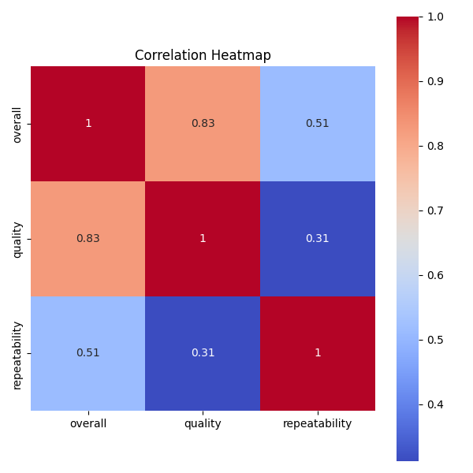
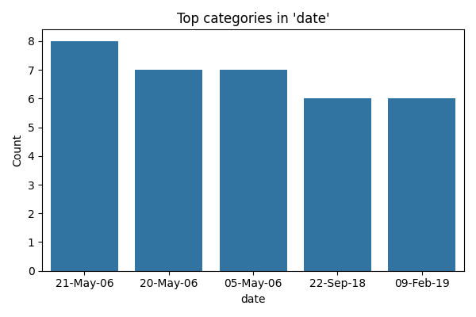
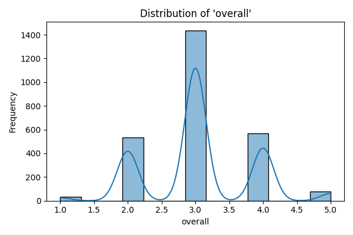

# Analysis of Media Dataset

## Introduction

The dataset `media.csv` comprises 2,652 entries and 8 columns, likely representing various media items, such as movies, TV series, and videos. Each entry captures essential attributes, including ratings, language, type, and contributors. Understanding this dataset can provide insights into media consumption patterns and preferences across different demographics.

## Key Insights

Our initial analysis revealed several noteworthy findings:

- **Missing Values**: The dataset contains 99 missing values in the `date` column, and 262 entries lack information in the `by` column, indicating potential gaps in the data that may need addressing to enhance analysis accuracy.
  
- **Summary Statistics**: The numeric columns—`overall`, `quality`, and `repeatability`—showed interesting trends:
  - The mean rating for `overall` is approximately 3.05, with a standard deviation of 0.76, suggesting a moderate level of satisfaction among viewers.
  - The `quality` ratings are slightly higher, with a mean of about 3.21, indicating that while viewers find the media acceptable, there is still room for improvement.
  - `Repeatability` scores averaged around 1.49, with most entries rated as 1 or 2, implying that many media items are not frequently revisited by viewers.

- **Top Categories**: Analysis of categorical columns provided further insights:
  - The majority of entries are in English (1,306), followed by Tamil (718) and Telugu (338), reflecting diverse linguistic representation.
  - The `type` column is dominated by movies (2,211), with fewer entries for TV series and non-fiction.
  - The `by` column shows a significant number of entries without an attributed creator (262), which could impact the understanding of media influence and popularity.

- **Correlation Matrix**: The correlation analysis revealed strong relationships among the numeric variables:
  - The `overall` rating has a strong positive correlation (0.826) with `quality`, suggesting that higher quality ratings are associated with better overall ratings.
  - A moderate correlation (0.513) exists between `overall` and `repeatability`, indicating that items rated higher are somewhat more likely to be revisited.

## Visualizations

To illustrate these findings, we created several visualizations:

1. **Correlation Heatmap**:  - This heatmap visually represents the correlations among the numeric variables, highlighting the strong relationship between `overall` and `quality`.

2. **Top Categories**:  - This chart displays the most frequent categories within the dataset, providing a quick overview of the dominant languages, types, and titles.

3. **Numeric Distribution**:  - This visualization depicts the distribution of the numeric ratings, allowing us to observe the skewness and spread of viewer ratings across the media items.

## Conclusion and Next Steps

The analysis of the `media.csv` dataset reveals valuable insights into viewer preferences and media characteristics. The presence of missing values and the lack of attribution in the `by` column suggest areas for improvement in data collection and completeness. 

Next steps could involve:
- Imputing missing values or excluding incomplete rows to refine the dataset.
- Conducting deeper analyses to explore potential factors influencing viewer ratings, such as genre or release date.
- Investigating the impact of specific creators on overall ratings and repeatability, which could guide content creation strategies.

By leveraging these insights, media producers and analysts can better understand audience preferences and improve the quality of media offerings.